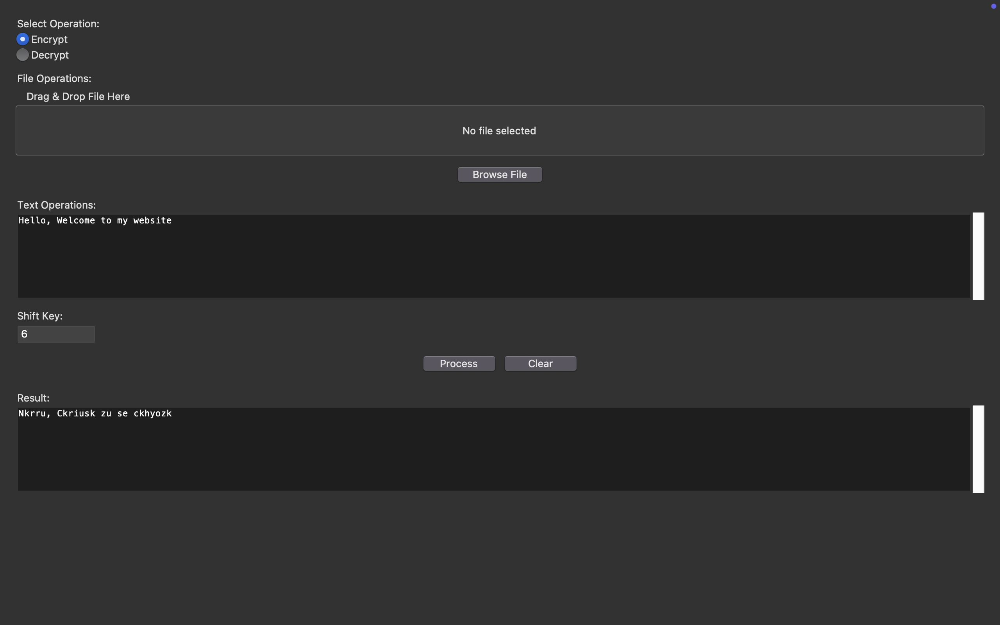

# Caesar Cipher Encryption/Decryption Tool

 <!-- Add actual screenshot later -->

A Python GUI application for encrypting/decrypting text and files using the classic Caesar Cipher algorithm.

## Table of Contents
- [Introduction](#introduction)
- [Features](#features)
- [Installation](#installation)
- [Usage](#usage)
- [How It Works](#how-it-works)
- [Limitations](#limitations)
- [License](#license)

## Introduction
The Caesar Cipher is one of the oldest encryption techniques, used by Julius Caesar to protect military communications. This project implements a modern GUI version that handles both text input and file encryption/decryption (.txt and .docx formats).

## Features
- **Text Encryption/Decryption**: Direct input/output in GUI text areas
- **File Support**: Process .txt and .docx files (preserves Word document structure)
- **Shift Customization**: Choose shift values between 1-25
- **Drag-and-Drop**: Intuitive file handling using TkinterDnD2
- **Real-time Results**: Instant encryption/decryption feedback
- **Error Handling**: Input validation for shift keys and file types

## Installation
1. Clone repository:
```bash 
git clone https://github.com/AdityaSomasagar/Encryption-and-decryption-tool.git
cd caesar-cipher-tool

## Usage <a name="usage"></a>

### Text Encryption/Decryption
1. **Input Text**: Type or paste text into the input area  
2. **Set Shift Key**: Enter an integer between 1-25 in the shift field  
3. **Choose Operation**:  
   - Click **"Encrypt"** to encode text  
   - Click **"Decrypt"** to decode text  
4. **View Results**: Encrypted/decrypted text appears in the output area  

### File Operations
1. **Add Files**:  
   - Drag-and-drop `.txt` or `.docx` files into the interface  
   - **OR** click **"Browse File"** to select manually  
2. **Set Shift Key**: Enter a valid integer (1-25)  
3. **Process File**:  
   - Click **"Encrypt"** or **"Decrypt"**  
4. **Save Output**:  
   - Choose a save location via the file dialog  
   - Processed files retain original formatting (for `.docx`)  

### Shift Key Rules  
| Scenario          | Behavior                          |  
|--------------------|-----------------------------------|  
| Shift = 0          | Rejected (invalid)                |  
| Shift > 25         | Auto-adjusted via `mod 26`        |  
| Non-integer input  | Error message displayed           |  

---
